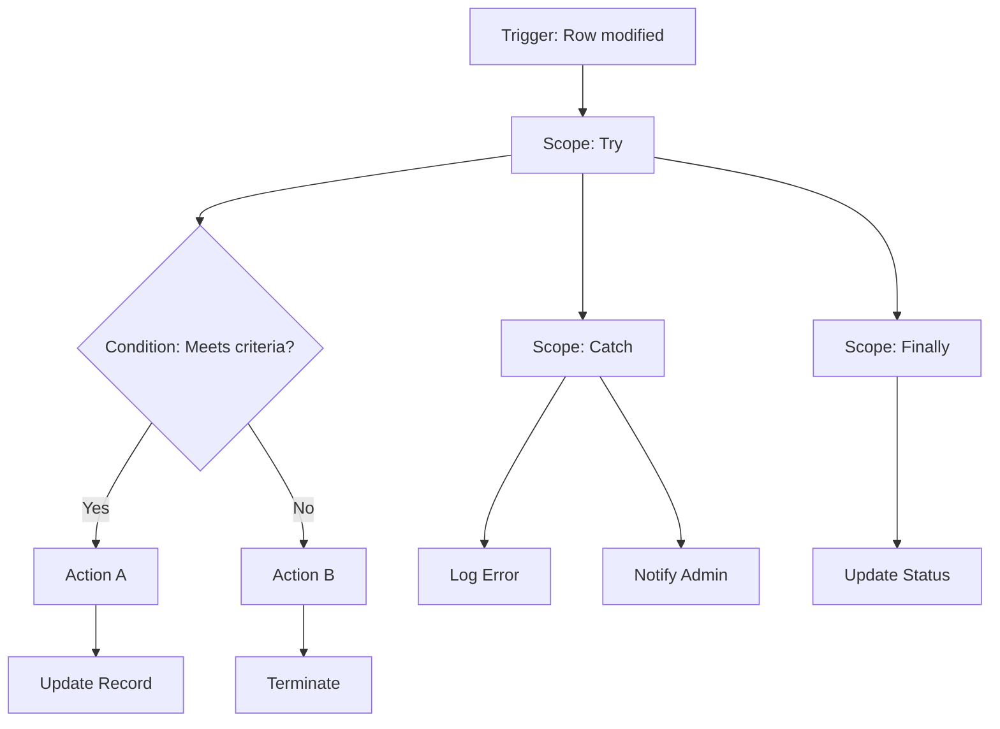

# Cloud Flow Builder

Design, document, and standardize Power Automate Cloud Flows for Dynamics 365 and Power Platform projects.

---

## 1. Flow Naming Convention

Every flow **must** follow this pattern:

```
[Scope]_[Entity]_[Action]
```

| Segment | Description | Examples |
|---------|-------------|----------|
| **Scope** | Business area or functional domain | Sales, Support, Marketing, System, HR, Finance, Operations, IT |
| **Entity** | Primary Dataverse table involved | Opportunity, Case, Contact, Account, Lead, Invoice, Order |
| **Action** | What the flow does (verb + complement) | SendApproval, EscalateToManager, SyncToMailchimp, CalculateScore |

### Examples

| Flow Name | Purpose |
|-----------|---------|
| `Sales_Opportunity_SendApproval` | Send approval when opportunity amount exceeds threshold |
| `Support_Case_EscalateToManager` | Escalate high-priority cases to the support manager |
| `System_Contact_SyncToMailchimp` | Sync contact data to Mailchimp on create/update |
| `HR_Employee_OnboardingChecklist` | Create onboarding tasks when new employee record is created |
| `Finance_Invoice_SendReminder` | Send payment reminder 7 days before due date |
| `Marketing_Lead_QualifyAndRoute` | Score and route new leads to the correct sales team |

### Rules

- Use **PascalCase** for each segment.
- Keep the action descriptive but concise (2-3 words maximum).
- If a flow spans multiple entities, use the **primary** entity (the one that triggers the flow).
- Prefix with `TEST_` during development and remove before deployment.

---

## 2. Trigger Types and When to Use

### 2.1 Automated — Dataverse Trigger

The most common trigger for Dynamics 365 flows.

| Trigger | Use When |
|---------|----------|
| When a row is added | A new record is created in a table |
| When a row is added, modified or deleted | You need to react to any change on a record |
| When a row is modified | A specific field value changes on an existing record |
| When a row is deleted | A record is removed |
| When an action is performed | A Custom API or action is executed |

**Critical rule — Filtering Attributes**: For update triggers, **always** specify filtering attributes to avoid unnecessary flow runs. Without filters, the flow fires on every field change, including system fields like `modifiedon`.

Example: If you only care about `statuscode` changes, set `Filtering Attributes = statuscode`.

### 2.2 Automated — Other Connectors

| Trigger | Use When |
|---------|----------|
| When a new email arrives (Outlook) | React to incoming emails |
| When a file is created (SharePoint) | Process uploaded documents |
| When an HTTP request is received | Expose a webhook endpoint |
| When a message is posted (Teams) | React to Teams messages |

### 2.3 Instant (Manual)

| Trigger | Use When |
|---------|----------|
| Manually trigger a flow | Button in a model-driven app, canvas app, or the flow portal |
| For a selected row | User selects a record and triggers the flow from the command bar |
| Power Apps (V2) | Called from a canvas or custom page |

### 2.4 Scheduled

| Trigger | Use When |
|---------|----------|
| Recurrence | Recurring processes: daily data sync, weekly report generation, monthly cleanup |
| Sliding window | Need guaranteed processing of every interval even if previous run is still active |

### Trigger Selection Guidance

```
Is it triggered by a data change?
├── Yes → Automated (Dataverse trigger)
│         Always set filtering attributes for updates.
├── Is it triggered by an external event?
│   ├── Yes → Automated (other connector)
│   └── No  → Continue
├── Does a user manually start it?
│   ├── Yes → Instant trigger
│   └── No  → Continue
└── Does it run on a schedule?
    └── Yes → Scheduled trigger
```

---

## 3. Error Handling Pattern (MANDATORY)

**Every** flow must implement scope-based error handling using the Try/Catch/Finally pattern.

### Structure

```
Scope: Try
├── Action 1
├── Action 2
└── Action 3

Scope: Catch (Configure run after: "Try" has failed, has timed out)
├── Compose: Error Details → outputs('Try')?['error']
├── Create row: Error Log record in Dataverse
└── Send notification to admin / team

Scope: Finally (Configure run after: "Catch" has succeeded, has failed, has skipped)
├── Update row: Set processing status on trigger record
└── Compose: Flow result summary
```

### Configuration Steps

1. **Scope: Try** — place all business logic inside this scope.
2. **Scope: Catch** — click the three dots `...` → _Configure run after_ → check:
   - ✅ has failed
   - ✅ has timed out
   - ❌ is successful (uncheck)
   - ❌ is skipped (uncheck)
3. **Scope: Finally** — click the three dots `...` → _Configure run after_ → check:
   - ✅ has succeeded
   - ✅ has failed
   - ✅ is skipped
   - ❌ has timed out (optional, usually unchecked)

### Error Details Expression

Use this expression inside the Catch scope to extract error information:

```
outputs('Try')?['error']
```

For more granular information:

```
outputs('Try')?['error']?['code']
outputs('Try')?['error']?['message']
```

To get error details from a specific action inside Try:

```
actions('Action_Name')?['outputs']?['body']?['error']?['message']
```

### Error Log Table

Create a Dataverse table for error logging with these recommended columns:

| Column | Type | Description |
|--------|------|-------------|
| Name | String | Auto-generated or flow name |
| Flow Name | String | Name of the flow that failed |
| Flow Run URL | URL | Link to the flow run for debugging |
| Error Code | String | Error code from the error output |
| Error Message | Multiline Text | Full error message |
| Trigger Record ID | String | GUID of the record that triggered the flow |
| Trigger Entity | String | Logical name of the trigger entity |
| Occurred On | DateTime | Timestamp of the error |

---

## 4. Connection References

**ALWAYS** use Connection References instead of embedded connections. This enables ALM and environment migration.

### Naming Convention

```
{prefix}_{ConnectorName}_{Purpose}
```

| Connection Reference | Connector | Purpose |
|---------------------|-----------|---------|
| `contoso_Dataverse_Main` | Dataverse | Primary Dataverse operations |
| `contoso_Outlook_Notifications` | Office 365 Outlook | Sending email notifications |
| `contoso_SharePoint_Documents` | SharePoint | Document management |
| `contoso_Teams_Alerts` | Microsoft Teams | Posting alerts to channels |
| `contoso_HTTP_ExternalAPI` | HTTP with Azure AD | Calling external APIs |
| `contoso_Approvals_Main` | Approvals | Approval workflows |

### Rules

1. Store all Connection References in a **dedicated solution** or in the main project solution.
2. Use **one Connection Reference per connector per purpose** — do not create duplicates.
3. Document the service account or user that should own each connection in production.
4. Never hardcode credentials — always rely on the connection reference's authentication.

---

## 5. Environment Variables

Use Environment Variables for **all** configurable values. Never hardcode emails, URLs, thresholds, or IDs.

### Naming Convention

```
{prefix}_{Category}_{Name}
```

| Environment Variable | Type | Description | Example Value |
|---------------------|------|-------------|---------------|
| `contoso_Email_AdminAddress` | String | Admin email for notifications | `admin@contoso.com` |
| `contoso_Email_SupportTeam` | String | Support team distribution list | `support@contoso.com` |
| `contoso_System_MaxRetries` | Number | Maximum retry attempts | `3` |
| `contoso_System_BatchSize` | Number | Records per batch | `500` |
| `contoso_Approval_ThresholdAmount` | Number | Amount requiring approval | `10000` |
| `contoso_Integration_ExternalApiUrl` | String | External API base URL | `https://api.external.com/v2` |
| `contoso_Feature_EnableNotifications` | Boolean | Toggle notifications on/off | `true` |
| `contoso_Config_MappingRules` | JSON | Complex configuration object | `{"rule1": "value1"}` |
| `contoso_SharePoint_SiteUrl` | Data Source | SharePoint site reference | (data source reference) |

### Types

| Type | Use For |
|------|---------|
| **String** | Emails, URLs, names, identifiers |
| **Number** | Thresholds, counts, amounts, limits |
| **Boolean** | Feature flags, toggles |
| **JSON** | Complex configuration, mapping tables, lists |
| **Data Source** | Dataverse environment URLs, SharePoint sites |

### Rules

1. Always provide a **default value** and a **current value** for each environment variable.
2. Group related variables by category in the naming convention.
3. Document each variable's purpose, valid range, and impact of changing it.
4. Include environment variables in the solution for ALM.

---

## 6. Common Flow Patterns

### 6.1 Approval Flow

Trigger → Scope Try → Get Approver → Start Approval → Condition (Approve/Reject) → Update record → Notify requester → Scope Catch → Log error → Scope Finally → Update flag.

### 6.2 Data Sync Flow

Scheduled trigger → Scope Try → List rows (paginated) → Select (transform) → Apply to Each (upsert) → Summary → Scope Catch → Log error → Scope Finally → Create sync log.

### 6.3 Notification Flow

Dataverse trigger (filtered) → Scope Try → Condition (criteria met?) → Yes: Get recipients → Build body → Send → No: Terminate → Scope Catch → Log error → Scope Finally → Log result.

### 6.4 Scheduled Cleanup Flow

Recurrence → Scope Try → Do Until (no more records) → List rows (batch) → Delete/Archive → Increment counter → Summary → Scope Catch → Log error → Scope Finally → Create cleanup log.

---

## 7. Performance Best Practices

### 7.1 Concurrency Control

- **Parallelism = 1**: For sequential processing (number sequences, balance calculations).
- **Parallelism = 20-50**: For independent record processing.
- **Off (default)**: When parallel runs are acceptable.

### 7.2 Pagination

Enable pagination on _List rows_ when datasets may exceed 5,000 rows. Set the threshold and combine with `$filter` OData queries.

### 7.3 Avoid Unnecessary Apply to Each

| Instead of | Use |
|------------|-----|
| Apply to Each + Compose | `Select` action |
| Apply to Each + Condition | `Filter Array` action |
| Apply to Each + Update row | Dataverse batch operations |
| Nested Apply to Each | `Select` + `union()` |

### 7.4 Timeouts

- **HTTP actions**: `PT30S` to `PT2M`.
- **Approval actions**: `P7D` or `P14D`.
- **Do Until loops**: `PT1H` timeout + count limit.

### 7.5 Expressions Over Nested Conditions

```
if(empty(triggerOutputs()?['body/emailaddress1']), 'N/A', triggerOutputs()?['body/emailaddress1'])
if(contains(createArray('High','Critical'), triggerOutputs()?['body/prioritycode']), true, false)
```

### 7.6 Reduce API Calls

- Use **Select Columns** to retrieve only needed fields.
- Use **Expand Query** for related records in a single call.
- Cache reference data in **Compose** actions at flow start.

---

## 8. Documentation Template

For **every** flow, generate a documentation block using this template:

````markdown
# Flow: {FlowName}

## Purpose
{What this flow does, when it runs, and why it exists.}

## Trigger
- **Type**: Automated | Instant | Scheduled
- **Connector**: Dataverse | Outlook | HTTP | SharePoint | ...
- **Entity/Source**: {entity logical name or source}
- **Event**: Created | Modified | Deleted | Manual | Recurrence
- **Filter**: {filtering attributes or conditions}
- **Concurrency**: {degree of parallelism or "Default"}

## Process Diagram



## Actions

| # | Action Name | Type | Connector | Description |
|---|------------|------|-----------|-------------|
| 1 | {name} | {type} | {connector} | {description} |
| 2 | ... | ... | ... | ... |

## Connection References

| Name | Connector | Purpose |
|------|-----------|---------|
| {prefix}_{Connector}_{Purpose} | {Connector} | {What it is used for} |

## Environment Variables

| Name | Type | Description | Default Value |
|------|------|-------------|---------------|
| {prefix}_{Category}_{Name} | {type} | {description} | {default} |

## Error Handling

- **Try scope**: Contains all business logic actions.
- **Catch scope**: Runs when Try fails or times out. Logs error to `{ErrorLogTable}` and notifies `{AdminEmail}`.
- **Finally scope**: Runs always. Updates the trigger record with processing result.

## Testing

### Prerequisites
- {List required data and configuration}

### Test Cases
| # | Scenario | Steps | Expected Result |
|---|----------|-------|-----------------|
| 1 | Happy path | {steps} | {expected} |
| 2 | Error condition | {steps} | {expected} |
| 3 | Edge case | {steps} | {expected} |

### Testing Procedure
1. Ensure environment variables are configured.
2. Create or modify a test record matching trigger conditions.
3. Monitor the flow run in the Power Automate portal.
4. Verify outcomes in Dataverse and notification channels.
5. Test the Catch scope by simulating a failure (e.g., invalid data, permission error).
````

---

## 9. Workflow

Follow this sequence when the user requests a Cloud Flow:

1. **Gather requirements** — ask for:
   - Purpose of the flow (what business problem does it solve?)
   - Trigger type and source (what event starts the flow?)
   - Entities involved (which Dataverse tables are read/written?)
   - Business logic (what decisions, transformations, or actions are needed?)
   - Notification requirements (who should be notified and when?)
   - Error handling preferences (who receives error alerts?)
   - Performance considerations (expected volume, concurrency needs)

2. **Design the flow** — produce:
   - Flow name following the `[Scope]_[Entity]_[Action]` convention.
   - Trigger configuration with filtering attributes.
   - Step-by-step action list with scope-based error handling.
   - Mermaid process diagram.

3. **Generate documentation** — fill the template from section 8 with:
   - All actions listed in order.
   - Connection references identified.
   - Environment variables defined.
   - Error handling strategy described.

4. **Provide the Mermaid diagram** — generate a flowchart showing:
   - Trigger → Try scope → Business logic with conditions → Catch scope → Finally scope.
   - Use clear labels on each node and decision.

5. **List connection references** — identify every connector used and create a named reference following the convention in section 4.

6. **Define environment variables** — identify every configurable value and create an environment variable following the convention in section 5.

7. **Describe error handling** — detail:
   - What errors are expected and how each is handled.
   - Where errors are logged.
   - Who is notified and how.
   - What the Finally scope does regardless of outcome.

8. **Review checklist**:
   - [ ] Flow name follows `[Scope]_[Entity]_[Action]` convention.
   - [ ] Trigger has filtering attributes configured (for update triggers).
   - [ ] Scope-based Try/Catch/Finally error handling is implemented.
   - [ ] Connection References are used (no embedded connections).
   - [ ] Environment Variables are used for all configurable values.
   - [ ] Concurrency control is configured appropriately.
   - [ ] Pagination is enabled for large data queries.
   - [ ] Timeouts are set on HTTP and long-running actions.
   - [ ] Documentation template is fully completed.
   - [ ] Mermaid diagram accurately represents the flow.
   - [ ] Test cases cover happy path, error conditions, and edge cases.
