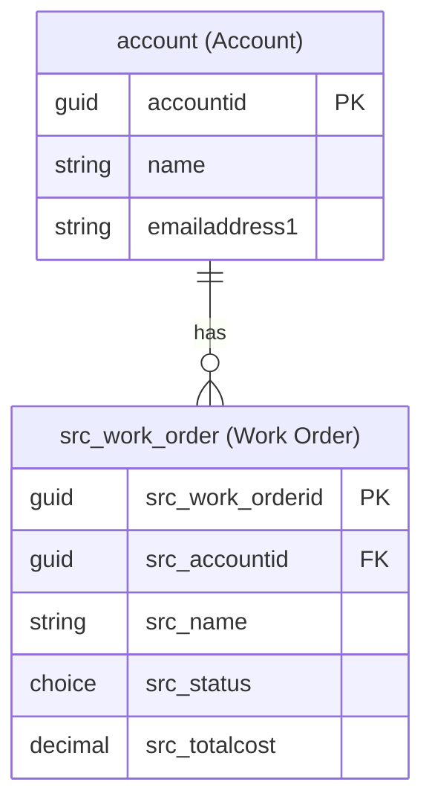

# Dataverse Schema Designer

**Triggers**: dataverse-schema, modelo de datos, diseña las tablas, schema dataverse, entidades, ER diagram
**Aliases**: /schema, /dataverse-schema, /modelo-datos

## Referencias

- **Convenciones**: [naming-conventions.md](../../references/naming-conventions.md)
- **Patrones Dataverse**: [dataverse-patterns.md](../../references/dataverse-patterns.md)

---

## Instrucciones

Sigue estos pasos en orden para cada invocación de `/dataverse-schema`.

### Paso 1: Verificar Entorno

```powershell
pac auth list
pac env who
```

Si no hay autenticación, informa al usuario:
```powershell
pac auth create --environment https://your-env.crm.dynamics.com
```

### Paso 2: Recopilar Información

Usa `AskUserQuestion` para preguntar (una a una si no están claras en el contexto):

1. **"¿Cuál es el dominio de negocio?"** — Describe brevemente qué gestiona el sistema.
2. **"¿Cuál es el prefijo del publisher?"** — (ej: `src_`). Si no lo sabe:
   ```powershell
   pac env who --json
   ```
3. **"¿Hay tablas existentes que reutilizar?"** — Contact, Account, Lead, Opportunity u otras custom.

Si el usuario proporcionó descripción al invocar `/dataverse-schema`, usa ese contexto directamente.

### Paso 3: Consultar Tablas Existentes

```powershell
pac modelbuilder list --type entity
```

Analiza tablas estándar reutilizables (Contact, Account, Product, etc.) para evitar duplicación.

### Paso 4: Diseñar el Modelo de Datos

Aplica estas reglas del estándar Fran (ver [naming-conventions.md](../../references/naming-conventions.md)):

#### Nomenclatura de Tablas

| Tipo | Ejemplo | Regla |
|------|---------|-------|
| Tabla custom | `src_work_order` | `{prefix}_{entity_name}` en snake_case |
| Tabla estándar reutilizada | `account`, `contact` | Nombre original sin prefijo |
| Relación N:N | `src_contact_src_project` | `{prefix}_{entity1}_{prefix}_{entity2}` |

#### Nomenclatura de Columnas

| Tipo | Ejemplo | Regla |
|------|---------|-------|
| Custom simple | `src_totalamount` | `{prefix}_{columnname}` en snake_case |
| Custom lookup | `src_accountid` | `{prefix}_{referencedentity}id` |
| Estándar reutilizada | `name`, `statuscode` | Sin prefijo |

#### Tipos de Columnas Disponibles

| Tipo | Cuándo usar |
|------|-------------|
| `SingleLine.Text` | Texto corto (hasta 4000 chars) |
| `MultiLine.Text` | Texto largo, notas, descripciones |
| `WholeNumber` | Enteros |
| `Decimal` | Números decimales |
| `Currency` | Valores monetarios (usa siempre Currency, no Decimal) |
| `DateTime` | Fecha y/o hora |
| `Boolean` | Sí/No |
| `Choice` | Option set (proporciona las opciones) |
| `Choices` | Multi-select option set |
| `Lookup` | FK a otra tabla |
| `Customer` | Lookup especial a Account o Contact |
| `Owner` | Lookup especial a User o Team |
| `Image` | Imagen |
| `File` | Archivo adjunto |
| `Uniqueidentifier` | GUID (solo PK) |

#### Mejores Prácticas de Diseño

1. **Reutiliza tablas estándar**: Account, Contact, Team, User, etc. antes de crear custom.
2. **Columna primaria**: Siempre define el nombre de la columna primaria (por defecto `name`).
3. **Status y Status Reason**: Incluye siempre si la tabla tiene ciclo de vida.
4. **Ownership**: User-owned (recomendado) o Organization-owned.
5. **Relaciones N:N**: Usa la tabla de intersección nativa de Dataverse.
6. **Virtual Tables**: Para datos externos sin replicación.
7. **Elastic Tables**: Para datos de alta velocidad/telemetría (>1M registros/día).
8. **Columnas calculadas**: Para valores derivados de otras columnas.
9. **Rollup columns**: Para agregaciones de child records.

### Paso 5: Presentar el Diseño en Plan Mode

Usa `EnterPlanMode` para presentar el diseño completo:

```markdown
## Modelo de Datos: [Nombre del Dominio]

**Publisher Prefix**: `src_`

### Tablas

#### [Tabla 1: src_work_order] — Nueva
**Display Name**: Work Order | **Ownership**: User-owned

| Columna (Logical Name) | Display Name | Tipo | Requerida | Notas |
|------------------------|-------------|------|-----------|-------|
| `src_work_orderid` | Work Order | Uniqueidentifier | Sí | PK |
| `src_name` | Title | SingleLine.Text | Sí | Primary column |
| `src_description` | Description | MultiLine.Text | No | |
| `src_status` | Status | Choice | Sí | Options: Open, In Progress, Completed, Cancelled |
| `src_accountid` | Account | Lookup (account) | No | |
| `src_totalcost` | Total Cost | Currency | No | |
| `createdon` | Created On | DateTime | Auto | System field |
| `ownerid` | Owner | Owner | Auto | System field |

**Relaciones**:
- N:1 con `account` — Una cuenta puede tener múltiples órdenes de trabajo

#### [Tabla 2: contact] — Reutilizada (estándar)
Usada como-es. Campos relevantes: `fullname`, `emailaddress1`, `telephone1`.

### Diagrama ER



### PAC CLI — Comandos de Creación

```powershell
# Crear la tabla
pac table create --display-name "Work Order" --plural-display-name "Work Orders" --schema-name "src_work_order" --ownership User

# Añadir columnas
pac table add-column --display-name "Description" --schema-name "src_description" --type MultiLine --table "src_work_order"
pac table add-column --display-name "Total Cost" --schema-name "src_totalcost" --type Currency --table "src_work_order"
pac table add-column --display-name "Status" --schema-name "src_status" --type Choice --table "src_work_order"

# Exportar solution para versionado
pac solution export --path ./solutions/DataModel --name DataModelSolution --managed false
```
```

Tras aprobación, ejecuta los comandos PAC CLI para crear las tablas.

### Paso 6: Generar Documentación

Tras crear el modelo, genera automáticamente:
1. Un diagrama ER en formato Mermaid.
2. Un fichero `data-model.md` con la definición completa de tablas y columnas.
3. Instrucciones para actualizar el solution y exportar.

```powershell
# Verificar creación
pac table list
pac solution export --path ./solutions --name [SolutionName] --managed false
```

### Paso 7: Resumen Final

Proporciona:
- Listado de tablas creadas (nuevas) y reutilizadas (existentes)
- Diagrama ER final
- Próximos pasos: añadir a solución, configurar seguridad (`/security-design`), generar early bound types (`pac modelbuilder build`)
