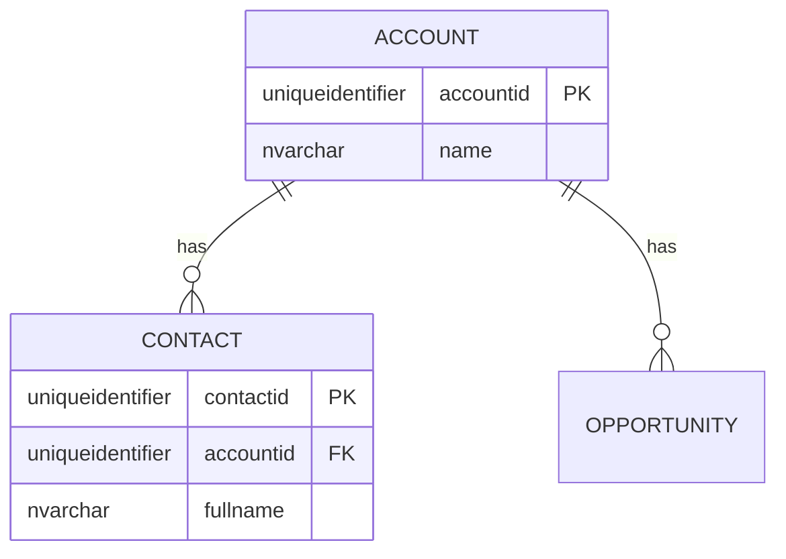
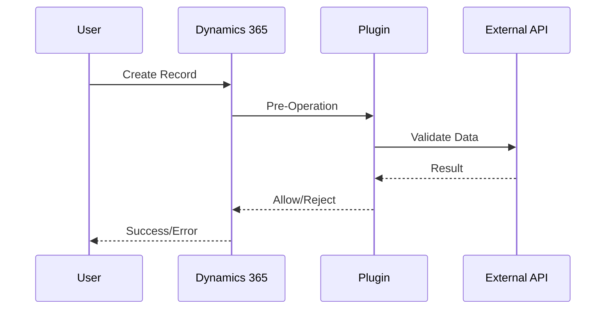
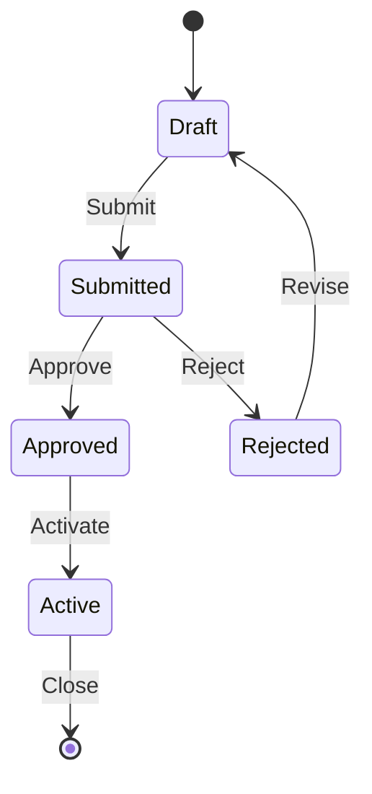

# Documentation Generator

Generate technical documentation for Dynamics 365 and Power Platform projects. This skill produces structured, accurate documentation following the Diátaxis framework, Microsoft Writing Style Guide, and industry standards.

## 1. Diátaxis Framework Classification

Before generating any document, classify it into one of the four Diátaxis categories. This determines the tone, structure, and content approach.

| Category | Orientation | Description | Example |
|----------|-------------|-------------|---------|
| **Tutorial** | Learning-oriented | Step-by-step guide for beginners. "Follow along to learn..." | "Getting started with the Customer Portal" |
| **How-to Guide** | Task-oriented | Practical steps for a specific goal. "How to configure..." | "How to configure SSO for the Partner Portal" |
| **Reference** | Information-oriented | Technical description of APIs, schemas, config. Accurate and complete. | "Custom API Reference: CreateInvoice" |
| **Explanation** | Understanding-oriented | Conceptual discussion. "Why we chose..." | "Why we chose event-driven integration over batch sync" |

**Classification rules**:

- README → Primarily **Reference** with some **Tutorial** elements.
- ADR → **Explanation** (focuses on *why* a decision was made).
- API Documentation → **Reference** (precise, complete, structured).
- Deployment Guide → **How-to Guide** (step-by-step to achieve a goal).
- Data Model Documentation → **Reference** with **Explanation** for design rationale.
- CHANGELOG → **Reference** (factual record of changes).
- Release Notes → **How-to Guide** + **Reference** hybrid (what changed + how to use it).


## 2. Documentation Types

### 2a. README — Project Overview

Use this template for project or solution README files.

```markdown
# {Project Name}

{One or two sentence description of what this project does and who it's for.}

## Overview

{Brief explanation of the project purpose, the business problem it solves,
and the high-level architecture. Keep it to 3-5 sentences.}

## Prerequisites

- Power Platform environment with Dataverse
- {List specific versions, tools, permissions}

## Installation / Setup

{Step-by-step setup instructions.}

## Usage

{How to use the solution after setup. Include screenshots or examples.}

## Architecture

{High-level description with a Mermaid diagram.}

## Configuration

{Environment variables, connection references, configuration tables.}

## Testing

{How to run tests, what test coverage looks like.}

## Deployment

{How to deploy to different environments. Link to Deployment Guide if separate.}

## Contributing

{Contribution guidelines, branch naming, PR process.}

## License

{License information.}
```

### 2b. ADR — Architecture Decision Record

Use ADRs to document significant technical decisions. Store them in `docs/adr/` with sequential numbering.

```markdown
# ADR-{NNN}: {Title}

**Date**: YYYY-MM-DD
**Status**: Proposed | Accepted | Deprecated | Superseded by ADR-{NNN}

## Context

{Describe the situation, the forces at play, and why a decision is needed.
Include business drivers, technical constraints, and relevant requirements.}

## Decision

{State the decision clearly and concisely. Explain what you will do.}

## Alternatives Considered

| Alternative | Pros | Cons |
|-------------|------|------|
| {Option A} | {Pros} | {Cons} |
| {Option B} | {Pros} | {Cons} |
| {Option C} | {Pros} | {Cons} |

## Consequences

### Positive
- {List positive outcomes}

### Negative
- {List negative outcomes or trade-offs}

### Risks
- {List risks and mitigations}

## References

- {Links to relevant documentation, Microsoft Learn articles, internal docs}
```

### 2c. API Documentation — Custom APIs

Document every Custom API with this structure. Include all four usage examples.

```markdown
# Custom API: {MessageName}

{Brief description of what this API does.}

## Metadata

| Property | Value |
|----------|-------|
| **Message Name** | `{prefix}_{MessageName}` |
| **Binding Type** | Global / Entity (`{entity_logical_name}`) |
| **Is Function** | Yes / No |
| **Is Private** | Yes / No |
| **Plugin Type** | `{Namespace}.{ClassName}` |
| **Allowed Custom Processing Step Type** | None / Async Only / Sync and Async |

## Request Parameters

| Name | Type | Required | Description |
|------|------|----------|-------------|
| `{ParamName}` | `{DataType}` | Yes/No | {Description} |

## Response Properties

| Name | Type | Description |
|------|------|-------------|
| `{PropertyName}` | `{DataType}` | {Description} |

## Error Codes

| Code | Message | Cause |
|------|---------|-------|
| `{ErrorCode}` | `{Message}` | `{Description}` |

## Usage Examples

### C# (SDK)

{C# code example using OrganizationRequest}

### JavaScript (Web API)

{JavaScript fetch example calling the Web API endpoint}

### OData

{Raw HTTP request example}

### Power Automate

{Description of how to call from a flow using an unbound/bound action}

## Security

{Required privileges, security roles, and field-level security considerations.}
```

### 2d. Deployment Guide

```markdown
# Deployment Guide: {Solution/Project Name}

## Prerequisites

| Requirement | Details |
|-------------|---------|
| Environment | {Target environment type and URL} |
| Permissions | {Security roles needed for deployment} |
| Tools | {PAC CLI version, VS version, etc.} |
| Dependencies | {Other solutions that must be installed first} |

## Solution Import Order

{List solutions in the order they must be imported.}

1. `{BaseSolution}_managed.zip` — Core tables and components
2. `{ExtensionSolution}_managed.zip` — Customizations and plugins
3. `{DataSolution}_managed.zip` — Reference data and configuration

## Pre-Deployment Steps

1. **Backup** — Export the current unmanaged solution as a backup.
2. **Notify stakeholders** — Inform users of potential downtime.
3. {Additional pre-deployment steps}

## Deployment Procedure

{Step-by-step procedure with exact commands or UI instructions.}

## Post-Deployment Validation

- [ ] Verify all solution components are present
- [ ] Test key business processes
- [ ] Validate integration endpoints
- [ ] Confirm security roles and permissions
- [ ] Check plugin/workflow execution
- {Additional validation steps}

## Rollback Procedure

{Step-by-step rollback instructions in case of failure.}

## Environment-Specific Configuration

| Setting | Development | Staging | Production |
|---------|-------------|---------|------------|
| {Setting name} | {Value} | {Value} | {Value} |
```

### 2e. Data Model Documentation

```markdown
# Data Model: {Domain/Module Name}

## Overview

{Brief description of this data domain, its purpose, and key entities.}

## Entity Relationship Diagram

{Generate a Mermaid ER diagram. See section 3 for syntax.}

## Tables

### {Table Display Name} (`{logical_name}`)

{Purpose and business context of this table.}

**Key Columns**:

| Display Name | Logical Name | Type | Description |
|-------------|--------------|------|-------------|
| {Name} | `{logical_name}` | {Type} | {Business meaning} |

**Relationships**:

| Related Table | Type | Lookup Column | Description |
|---------------|------|---------------|-------------|
| {Table} | N:1 / 1:N / N:N | `{column}` | {Relationship meaning} |

**Business Rules**:

- {List business rules applied to this table}

**Automations**:

- {List plugins, flows, or workflows triggered by this table}

**Security**:

- {Table-level and column-level security settings}

{Repeat for each table in the domain.}
```

### 2f. CHANGELOG — Keep a Changelog Format

Follow [Keep a Changelog](https://keepachangelog.com/):

```markdown
# Changelog

All notable changes to this project are documented here.
Format based on [Keep a Changelog](https://keepachangelog.com/), using [Semantic Versioning](https://semver.org/).

## [Unreleased]

## [1.0.0] - YYYY-MM-DD
### Added
### Changed
### Fixed
### Removed
```

**Rules**: Group by Added/Changed/Deprecated/Removed/Fixed/Security. Reverse chronological order. Start entries with a verb. Reference Jira keys (e.g., `[PROJ-123]`).

### 2g. Release Notes

User-facing, less technical than CHANGELOG. Template:

```markdown
# Release Notes: v{X.Y.Z}
**Release Date**: YYYY-MM-DD
## Highlights
{2-3 sentence summary of the most impactful changes.}
## New Features
- **{Feature Name}** — {Description.}
## Improvements
- **{Improvement}** — {What changed and why.}
## Bug Fixes
- **{Fix}** — {What was broken and how it's fixed.}
## Breaking Changes
- **{Change}** — {What changed, who is affected, and what to do.}
## Known Issues
- {Known issues in this release.}
## Upgrade Instructions
{Steps for upgrading from the previous version.}
```


## 3. Mermaid Diagrams

Use Mermaid.js syntax for all visual documentation. Choose the diagram type based on context:

| Diagram Type | Use Case | Mermaid Keyword |
|--------------|----------|-----------------|
| ER Diagram | Data models, table relationships | `erDiagram` |
| Flowchart | Business processes, decision flows | `flowchart TD` |
| Sequence Diagram | Integrations, API call flows | `sequenceDiagram` |
| C4 / Graph | Architecture overviews | `graph TB` with `subgraph` |
| State Diagram | Entity lifecycle, status transitions | `stateDiagram-v2` |

### ER Diagram example



### Sequence Diagram example



### State Diagram example




## 4. Writing Guidelines — Microsoft Writing Style

Apply these rules to all generated documentation:

- **Active voice**: Write "The plugin validates the data" not "The data is validated by the plugin."
- **Present tense**: Write "This API returns a list" not "This API will return a list."
- **Address the user**: Write "You can configure..." not "The user can configure..."
- **Short sentences**: Aim for 15-20 words per sentence. Break complex ideas into multiple sentences.
- **Bullet points and headings**: Use them liberally for scannability. Avoid walls of text.
- **No undefined jargon**: If you use a term like "plugin step," define it on first use or link to the Microsoft Learn definition.
- **Consistent terminology**: Use the same term for the same concept throughout. Avoid synonyms that create ambiguity (e.g., pick "table" or "entity" and stick with it — prefer "table" for modern docs).
- **Sentence-case headings**: Capitalize only the first word and proper nouns (e.g., "Data model overview" not "Data Model Overview"). Exception: product names like "Dynamics 365" and "Power Platform."
- **Links to official docs**: Reference Microsoft Learn articles for standard concepts rather than re-explaining them.


## 5. Code Documentation

### C# — XML Doc Comments (`///`)

Add to all public types and methods in plugins and Custom APIs:

```csharp
/// <summary>
/// Validates phone number follows E.164 format before Contact is saved.
/// </summary>
/// <remarks>
/// Registered on: Pre-Operation of Create/Update for Contact.
/// </remarks>
public class PhoneValidationPlugin : IPlugin
{
    /// <param name="serviceProvider">Provides execution context and services.</param>
    /// <exception cref="InvalidPluginExecutionException">Phone number invalid.</exception>
    public void Execute(IServiceProvider serviceProvider) { }
}
```

### TypeScript / JavaScript — JSDoc (`/** */`)

Add to exported functions, classes, and interfaces:

```typescript
/**
 * Formats a phone number to E.164 international format.
 * @param phoneNumber - Raw phone number string.
 * @param countryCode - ISO 3166-1 alpha-2 code (e.g., "US").
 * @returns Formatted E.164 string (e.g., "+14155552671").
 * @throws {Error} If phone number is invalid for the country.
 */
export function formatPhoneNumber(phoneNumber: string, countryCode: string): string { }
```

### What to document

- **Public APIs**: Always document exported/public types and methods.
- **Complex logic**: Explain *why*, not *what*.
- **Business rules**: Comment the business reason behind validations.
- **Do not over-comment**: Skip comments for self-explanatory code.


## 6. Workflow

When a user requests documentation, follow this process:

1. **Gather requirements** — Ask the user for:
   - **Document type**: README, ADR, API docs, deployment guide, data model, CHANGELOG, release notes.
   - **Scope/component**: What project, solution, or feature is being documented.
   - **Audience**: Developers, administrators, end users, or mixed.
   - **Language**: The written language for the document (default: English).

2. **Classify using Diátaxis** — Determine the primary category (Tutorial, How-to, Reference, Explanation). Some documents span multiple categories; identify the primary one and note secondary aspects.

3. **Generate structure skeleton** — Create the heading structure using the appropriate template from section 2.

4. **Fill with content** — Populate each section with accurate, specific content. If documenting an existing data model or solution:
   - Use Dataverse MCP tools (`list_tables`, `describe_table`, `read_query`) to inspect the actual environment.
   - Use Microsoft Learn MCP (`microsoft_docs_search`) to verify technical terminology and link to official docs.

5. **Add Mermaid diagrams** — Generate diagrams where they add clarity:
   - Data model → ER diagram
   - Business process → Flowchart
   - Integration → Sequence diagram
   - Architecture → C4-style graph
   - Entity lifecycle → State diagram

6. **Review against quality checklist** — Apply the checklist from section 7 before delivering.


## 7. Quality Checklist

Apply this checklist to every generated document before delivering it:

- [ ] **Diátaxis classification**: The document clearly fits one of the four categories and follows the appropriate tone.
- [ ] **Heading structure**: Clear, logical hierarchy. No skipped levels (e.g., no `###` directly under `#`).
- [ ] **Code examples**: Complete, runnable, and syntactically correct. No pseudo-code unless explicitly noted.
- [ ] **Technical accuracy**: Terms match official Microsoft documentation. Verify with Microsoft Learn MCP when uncertain.
- [ ] **Mermaid diagrams**: Syntactically correct and render without errors. Test complex diagrams mentally before including.
- [ ] **No placeholders**: All `{placeholder}` values are either replaced with real values or clearly marked as templates the user must fill in.
- [ ] **Official links**: Key concepts link to the relevant Microsoft Learn article.
- [ ] **Consistent formatting**: Tables are aligned, code blocks specify the language, headings use sentence case.
- [ ] **Active voice and present tense**: The document follows Microsoft Writing Style Guide conventions.
- [ ] **Audience-appropriate**: The complexity and terminology match the stated audience.
